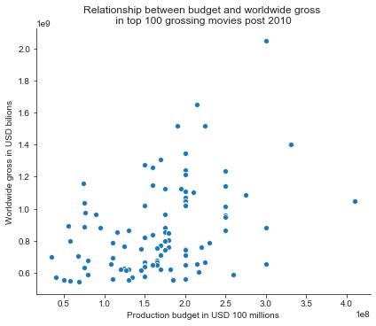
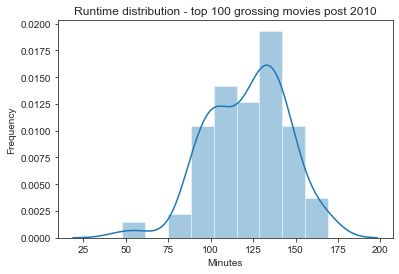
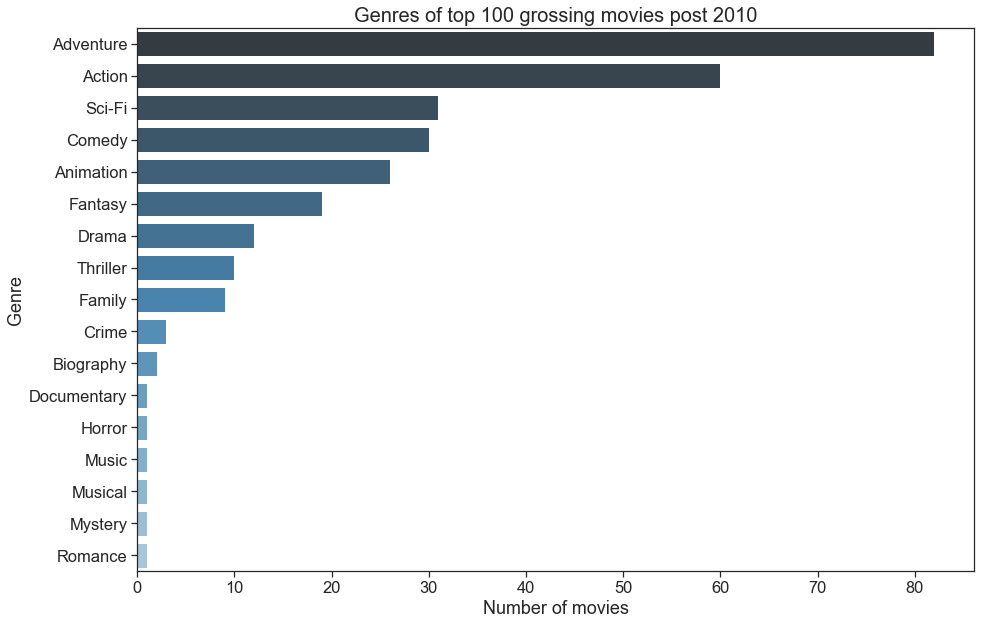
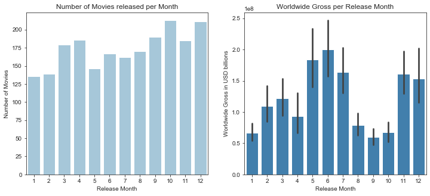

# Making Movies Project

This project was completed as part of Flatiron School's Data Science Bootcamp (Module 1 Final Project).

## Problem statement
In January 2020, Microsoft Inc. ("the Company") decides to enter the movie industry and creates a movie studio. The company approaches consultancy XYZ to provide a data-driven understanding of the industry and characteristics of a successful movie.

The Company is after actionable insights to shape their new venture.

## Components

* **Jupyter Notebook**

The [Jupyter Notebook](https://github.com/nadinezab/making-movies/blob/master/Making%20Movies.ipynb) is our key deliverable and contains details of our approach and methodology, data mining and cleaning, visualisations and insights and recommendations. 

I recommend using [nbviewer](https://nbviewer.jupyter.org/) to view the Jupyter Notebook.

* **Presentation**

The presentation gives a high-level overview of our approach, findings and recommendations for non-technical stakeholders. It is aimed to be between 5 and 10 minutes long. There are two files, with and without presenter notes.

* **Data**

The data can be found in the ZippedData folder. It was originally provided in the following [repository](https://github.com/learn-co-students/dsc-mod-1-project-v2-1-onl01-dtsc-pt-012120/tree/master/zippedData).

* **Blog Post**

A [blog post](https://towardsdatascience.com/5-technical-takeaways-from-my-first-eda-project-f806375574ce?source=friends_link&sk=85b2ff54b7d20f1d90ea89f3cc13e185) published in Towards Data Science was created focusing on key technical takeaways from completing this project.  

## Technologies
* Python version: 3.6.9
* Matplotlib version: 3.1.3
* Seaborn version: 0.9.0
* Pandas version: 0.25.1
* Numpy version: 1.16.5
* BeautifulSoup version: 4.8.0
* WordCloud version: 1.6.0

## To get started

1. Clone this repository - [guidance](https://help.github.com/articles/cloning-a-repository/).
2. Data data can be found in the ZippedData folder.
3. Check requirements in Technologies section above and download libraries if necessary.

## Key Findings

**Budget**
- Strong negative correlation between budget and profit margin.
- No correlation between budget and worldwide gross amongst top 100 grossing movies post 2010.

**Runtime**
- Average runtime is 100 minutes.
- Top movies are longer, around 120 minutes.
- No direct correlation between runtime and worldwide gross, nor runtime and production budget

**Genre**
- More than 80% of the top 100 grossing movies post 2010 can be described as adventure movies and 60% fall into action.
- An action and/or adventure movies costs on average $45 million more.

**Release date**
- Most successful months are May/June and November.
- Most movies are released on a Friday.

**Netflix Original Movies**
- Characteristics differ for an online distribution model.
- Around 70 movies released per annum (based on 2018 and 2019).
- Runtime of around 99 minutes.
- Comedy and drama are most popular.

**Movies based on video games**
- Between 1 and 3 such movies released each year.
- Average worldwide gross of $135 million and average budget of $50 million.
- Action and Aventure are most popular.
- Company's existing franchises to leverage: Halo, Forza and Minecraft.

## Actionable Insights

1. Have a **budget** of at least $50 million and ideally $150-200 million.
2. Produce a long movie, with a **runtime of at least 2 hours**.
3. Produce an **action/adventure** type of movie.
4. Aim for a release date in **May/June** or **November**
5. Decide whether to pursue Box Office or online distribution as characteristics differ
6. Consider utilising video games franchises to benefit from existing fanbase

## Contributors:

|Name     |  GitHub   |
|---------|-----------------|
|Nadine Amersi-Belton |https://github.com/nadinezab|

## Contact

* If you have any questions, you can contact me at nzamersi@gmail.com
